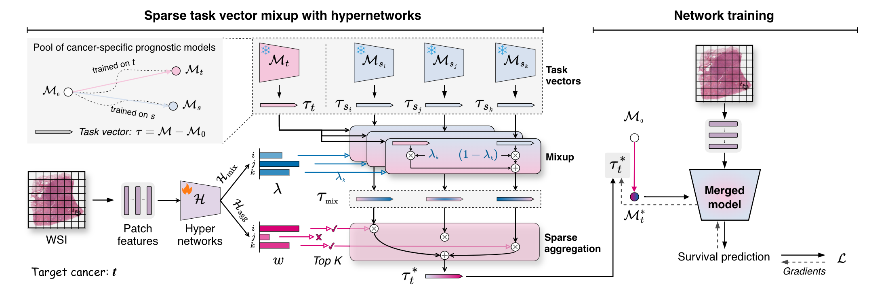

# STEPH: Sparse Task Vector Mixup with Hypernetworks for Efficient Knowledge Transfer in Whole-Slide Image Prognosis

[[Paper]](https://arxiv.org/abs/2603.10526) | [[Acknowledgements]](https://github.com/liupei101/STEPH?tab=readme-ov-file#acknowledgements) | [[Citation]](https://github.com/liupei101/STEPH?tab=readme-ov-file#-citation)

**Abstract**: Whole-Slide Images (WSIs) are widely used for estimating the prognosis of cancer patients. Current studies generally follow a cancer-specific learning paradigm. However, the available training samples for one cancer type are usually scarce in pathology. Consequently, the model often struggles to learn generalizable knowledge, thus performing worse on the tumor samples with inherent high heterogeneity. Although multi-cancer joint learning and knowledge transfer approaches have been explored recently to address it, they either rely on large-scale joint training or extensive inference across multiple models, posing new challenges in computational efficiency. To this end, this paper proposes a new scheme, Sparse Task Vector Mixup with Hypernetworks (STEPH). Unlike previous ones, it efficiently absorbs generalizable knowledge from other cancers for the target via model merging: i) applying task vector mixup to each source-target pair and then ii) sparsely aggregating task vector mixtures to obtain an improved target model, driven by hypernetworks. Extensive experiments on 13 cancer datasets show that STEPH improves over cancer-specific learning and an existing knowledge transfer baseline by 5.14% and 2.01%, respectively. Moreover, it is a more efficient solution for learning prognostic knowledge from other cancers, without requiring large-scale joint training or extensive multi-model inference.

<!-- Insert a pipeline of your algorithm here if got one -->
<div align="center">
    <a href="https://"></a>
</div>

---

*On updating. Stay tuned.*

📚 Recent updates:
- 26/04/06: Our code & training logs & model checkpoints have been released
- 26/03/11: initialized a repo for STEPH
- 26/02/20: STEPH is accepted to CVPR 2026

## 👩‍💻 Running the Code

### Pre-requisites

All of our experiments are run on a machine with
- two NVIDIA GeForce RTX 3090 GPUs
- python 3.8 and pytorch==1.11.0+cu113

Detailed package requirements:
- for `pip` or `conda` users, full requirements are provided in [requirements.txt](https://github.com/liupei101/STEPH/blob/main/requirements.txt).
- for `Docker` users, you could use our base Docker image via `docker pull yuukilp/deepath:py38-torch1.11.0-cuda11.3-cudnn8-devel` and then install additional essential python packages (see [requirements.txt](https://github.com/liupei101/STEPH/blob/main/requirements.txt)) in the container.

### Training models 

Use the following command to load an experiment configuration and train STEPH (5-fold cross-validation):
```bash
python3 main.py --config config/cfg_temp_steph.yaml --handler SATA --multi_run --cfg_dataset_name tcga_brca
```

For 5-fold data splits (placed at `./data_split/stratified-5foldcv`), please download them from [`UNI2-h-DSS`](https://huggingface.co/datasets/yuukilp/UNI2-h-DSS).

For base ABMIL survival models (fitted on cancer-specific WSI datasets), please download them from [here](https://drive.google.com/drive/folders/1KmChNZW4xg-hSLVPYZe8GVeP75Xb-7lm?usp=sharing).

## Training logs and model checkpoints

We advocate open-source research. Our full training logs can be accessed at [Google Drive](https://drive.google.com/drive/folders/1uAqF_WVz7CkU2nFbRMJR1zWS-fY3bih7?usp=sharing). 

## UNI2-h-DSS Dataset

Our model evaluation is based on the `UNI2-h-DSS` dataset. `UNI2-h-DSS` is specially designed for evaluating WSI-based survival prediction models.

`UNI2-h-DSS` consists of 13 cancer datasets and it provides complete DSS (disease-specific survival) labels and 5-fold balanced data splits for stable model evaluation.

Please access `UNI2-h-DSS` via [HuggingFace](https://huggingface.co/datasets/yuukilp/UNI2-h-DSS).

## Acknowledgements

We thank the following great works that contribute to this work:

- [UNI](https://github.com/mahmoodlab/UNI): a state-of-the-art foundation model for pathology; it is used to extract patch features from WSIs.
- [UNI2-h features](https://huggingface.co/datasets/MahmoodLab/UNI2-h-features): the datasets for this study are derived from it.
- [TCGA GDC Data portal](https://portal.gdc.cancer.gov/): it provides the source data for analysis.

## 📝 Citation

If you find this work helps your research, please consider citing our paper:
```txt
@inproceedings{liu2026steph,
    title={Sparse Task Vector Mixup with Hypernetworks for Efficient Knowledge Transfer in Whole-Slide Image Prognosis}, 
    author={Pei Liu and Xiangxiang Zeng and Tengfei Ma and Yucheng Xing and Xuanbai Ren and Yiping Liu},
    booktitle={Proceedings of the IEEE/CVF International Conference on Computer Vision},
    pages={1--12},
    year={2026}
}
```
